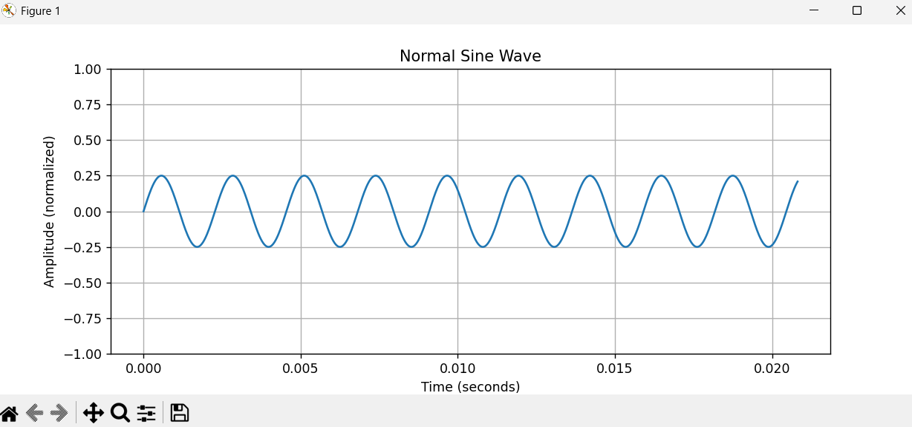
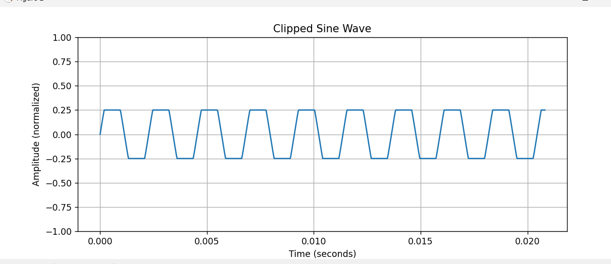

Computers, Sound And Music 001 Spring 2026
Assignment-2

# Bell 103 Modem Decoder

Name: Arthi Patibandla

## Overview

This project implements a decoder for audio signals encoded using the Bell 103 modem protocol.  
The program reads a WAV file containing frequency-shift keyed (FSK) data and converts it into a readable ASCII message.

---

## How It Works

### 1. Input

- The input file is `message.wav`
- Format:
  - Sample rate: 48,000 Hz
  - Mono channel
  - 16-bit PCM
- Each bit is represented by **160 samples** (300 baud)

---

### 2. Signal Processing

The audio signal is processed in blocks of 160 samples.

For each block:

- The program computes signal power at two frequencies:
  - **2025 Hz → bit 0**
  - **2225 Hz → bit 1**

This is done using correlation:

- Compute:
  - cosine reference
  - sine reference
- Then:
  - `I = dot(samples, cos)`
  - `Q = dot(samples, sin)`
- Power:
  - `power = I² + Q²`

The bit is determined by comparing powers:

- Higher power at 2025 Hz → `0`
- Higher power at 2225 Hz → `1`

---

### 3. Bit Decoding

- Bits are grouped into **10-bit frames**:
  - 1 start bit (0)
  - 8 data bits (LSB first)
  - 1 stop bit (1)

- Start and stop bits are validated
- Data bits are converted into bytes using LSB-first order

---

### 4. Output

- Bytes are converted into ASCII characters
- Final decoded message is: result below

## Result

You will live to see your grandchildren.

## How to run

python modem.py

---

## Assignment-1

Output

