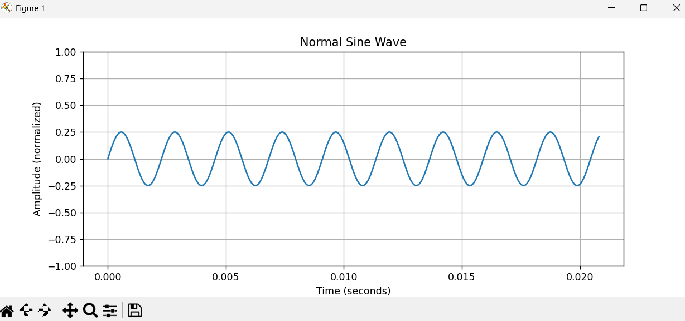
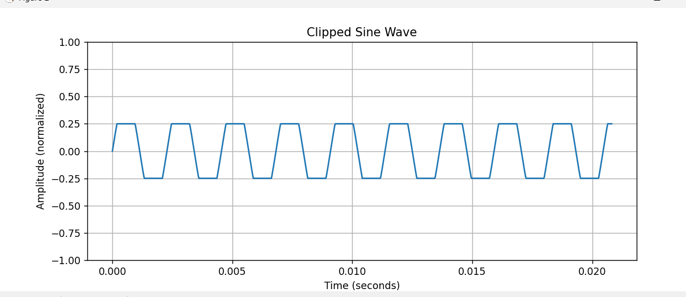

# Computers, Sound And Music 001 Spring 2026

# Assignment-3

# Aleatoric Music Generator

## Overview

This project implements an aleatoric music generator using Python.

The program creates music procedurally by randomly selecting a song structure, chord progressions, musical key, tempo, and melody notes. The generated melody is synthesized using sawtooth waves and can either be played directly through the computer speakers or saved as a WAV audio file.

How It Works

## 1. Song Structure

The program randomly selects one of the following song structures:

AABB/CC
ABAB/CD
AB/CDDD

Each letter represents a musical line consisting of a four-chord loop. Repeated letters use the same chord progression throughout the song.

## 2. Chord Progressions

For each unique label in the song structure, the program randomly selects a chord loop from the provided list:

I-IV-ii-V
I-vi-ii-V
I-iii-IV-iv
I-V-ii-V
I-vi-IV-V
IV-I-vi-IV
I-V-vi-I
I-IV-iv-I
IV-V-I-I
vi-IV-I-V

No two labels are assigned the same chord progression.

## 3. Key Selection

The program randomly selects a musical key in the range A3 to A4 inclusive.

The selected key is used to generate the major scale for the song.

## 4. Tempo Selection

A random tempo between 80 and 160 beats per minute (BPM) is selected.

The song uses common time:

4 beats per measure
16 beats per line

## 5. Melody Generation

The melody is generated using eighth notes.

For each note:

80% probability of choosing a note from the current chord
20% probability of choosing another note from the song's major scale

This creates melodies that generally follow the harmony while still introducing variation.

## 6. Sound Synthesis

The generated melody is synthesized using sawtooth waves.

A short fade-in and fade-out is applied to each note to reduce clicking noise and improve sound quality.

## 7. Output

The program supports two modes:

Play Audio Directly
python Aleatoric.py
Generate WAV File
python Aleatoric.py --output ALEATORIC.wav

# Assignment-2

## Bell 103 Modem Decoder

Name: Arthi Patibandla

## Overview

This project implements a decoder for audio signals encoded using the Bell 103 modem protocol.  
The program reads a WAV file containing frequency-shift keyed (FSK) data and converts it into a readable ASCII message.

---

## How It Works

### 1. Input

- The input file is `message.wav`
- Format:
  - Sample rate: 48,000 Hz
  - Mono channel
  - 16-bit PCM
- Each bit is represented by **160 samples** (300 baud)

---

### 2. Signal Processing

The audio signal is processed in blocks of 160 samples.

For each block:

- The program computes signal power at two frequencies:
  - **2025 Hz → bit 0**
  - **2225 Hz → bit 1**

This is done using correlation:

- Compute:
  - cosine reference
  - sine reference
- Then:
  - `I = dot(samples, cos)`
  - `Q = dot(samples, sin)`
- Power:
  - `power = I² + Q²`

The bit is determined by comparing powers:

- Higher power at 2025 Hz → `0`
- Higher power at 2225 Hz → `1`

---

### 3. Bit Decoding

- Bits are grouped into **10-bit frames**:
  - 1 start bit (0)
  - 8 data bits (LSB first)
  - 1 stop bit (1)

- Start and stop bits are validated
- Data bits are converted into bytes using LSB-first order

---

### 4. Output

- Bytes are converted into ASCII characters
- Final decoded message is: result below

## Result

You will live to see your grandchildren.

## How to run

python modem.py

---

## Assignment-1

Output

